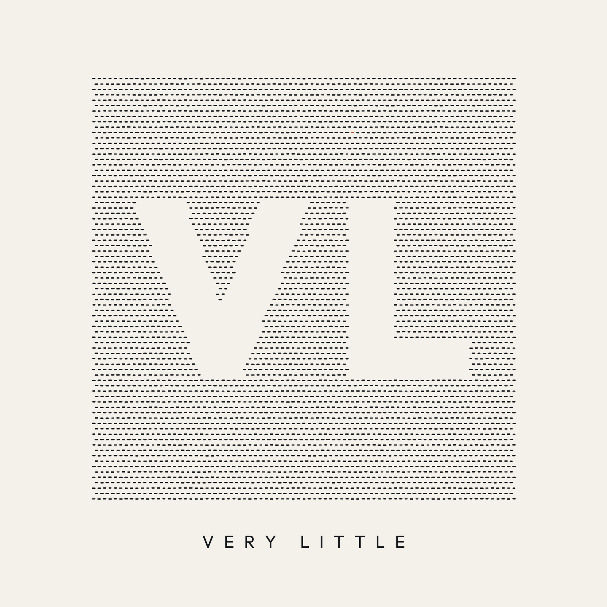

<p align="center">
  
</p>

# VL — Very Little

**Send very little to the model. Cut your AI coding costs — automatically.**

[](https://opensource.org/licenses/MIT)
[]()
[]()

---

## What is VL?

**VL (Very Little) is a token-efficiency toolkit for AI coding.** It ships two strategies, both validated with a real LLM tokenizer:

1. **Semantic Python minification** (`vl-minify`) — strips comments, docstrings and blank lines while guaranteeing identical semantics (AST-verified). **Measured ~20–30% real token savings**, zero correctness risk, nothing for the model to learn.
2. **VL v2 macros** (`vl2`) — single-line, **valid-Python** calls that stand for multi-line patterns (JSON I/O, CSV I/O, HTTP, retry loops, group-by aggregation...). **Measured 56–93% savings per use**; a conservative detector compresses existing Python into macro form, and the expander turns macros back into dependency-free standard Python. Combined with minification: **57% measured on a realistic module**. See [docs/vl2-design.md](docs/vl2-design.md).

Everything is plain Python in and plain Python out — there is no new language to learn, and nothing non-standard ever needs to run in production.

> ⚠️ **Why "Very Little" and not a compact language?** This project started as "Vibe Language", a token-compact syntax. Honest re-measurement with a real BPE tokenizer showed that compact *syntax* often costs **more** tokens than idiomatic Python, because tokenizers already compress Python extremely well. The language was removed; the two strategies that actually work remained. Full methodology and numbers: [docs/token-analysis.md](docs/token-analysis.md).

---

## Quick Start

### CLI

```bash
git clone https://github.com/pmarmaroli/vl.git
cd vl
pip install -e .
```

**Minify Python before sending it to an LLM (measured 20–30% savings):**

```bash
# Semantics-preserving minification (AST-verified)
vl-minify script.py -o script.min.py

# Or from stdin
cat script.py | vl-minify -
```

**VL v2 macros (56–93% savings on covered patterns):**

```bash
# Print the macro spec to include once in your LLM prompt (266 tokens, cacheable)
vl2 --spec

# Compress existing Python patterns into macros before sending to an LLM
vl2 -c script.py

# Expand LLM-generated macro code to dependency-free Python
vl2 generated.py -o runnable.py
```

**Measure real token savings on your own files:**

```bash
pip install -e ".[benchmarks]"
python tests/benchmarks/real_token_benchmark.py your_file.py
python tests/benchmarks/v2_macro_benchmark.py
```

### Python API

```python
from vl import minify, compress_macros, expand_macros, MACRO_SPEC

lean = minify(source)                      # plain Python, 20-30% fewer tokens
compressed, stats = compress_macros(source)  # known patterns -> macro calls
runnable = expand_macros(llm_output)       # macro calls -> standard Python
```

### VS Code Extension (Alpha)

1. Download the latest [.vsix from Releases](https://github.com/pmarmaroli/vl/releases)
2. VS Code → Extensions (`Ctrl+Shift+X`) → `...` menu → **Install from VSIX...**
3. Add your Anthropic API key: Command Palette → `VL: Set Anthropic API Key` (stored in VS Code secure storage)
4. Use `@vl` in VS Code chat:

```
@vl #file:script.py Can you help optimize this?
```

The extension minifies (or macro-compresses) your Python context before it reaches the model, tracks savings in a dashboard, and never sends anything more expensive than the original.

---

## The numbers

Measured with a real LLM tokenizer (Mistral Tekken, same BPE family as Claude/GPT tokenizers):

| Strategy | Real token savings |
|---|---|
| **Minification** (`vl-minify`) | **~20–30% on typical files** (up to 58% on heavily documented code) |
| **VL v2 macros** (`vl2`) | **56–93% per macro use**, 13-macro registry (spec amortizes after ~8 uses) |
| **Both combined** | **57% on a realistic module** |

**Why it works:** BPE tokenizers already compress idiomatic Python extremely well (`def `, ` return`, indentation ≈ 1 token each), so compact *characters* don't mean fewer *tokens*. Real savings come from removing what the model doesn't need (comments, docstrings, blank lines) and from collapsing multi-line patterns into single macro calls — not from shorter syntax.

Every macro must beat its own expansion on a real tokenizer to stay in the registry (`tests/benchmarks/v2_macro_benchmark.py` enforces this).

### The 13-macro registry

```text
data = jload(path)                      # read JSON file
jsave(obj, path)                        # write JSON file (indent=2)
lines = read_lines(path)                # file -> list of lines, no \n
write_lines(lines, path)                # list of lines -> file, adds \n
rows = csv_rows(path)                   # CSV file -> list of dicts
csv_save(rows, path)                    # list of dicts -> CSV file (w/ header)
r = run_cmd(cmd)                        # subprocess.run, capture+text+check
out = group_agg(items, by='key', val='field', fn=sum, where=lambda x: ...)
items = get_json(url, where=lambda r: ...)  # HTTP GET -> filtered JSON list
resp = post_json(url, payload)          # HTTP POST json -> parsed JSON
x = retry(lambda: fn(...), tries=3, delay=1)  # retry w/ exponential backoff
cfg = env_load(path)                    # .env file -> dict
files = walk_files(root, pattern)       # recursive glob -> sorted str paths
```

---

## Guarantees

- **Minifier:** the output must parse and its AST must exactly match the original (docstrings excepted). On any verification failure the original source is returned unchanged.
- **Macro expander:** expansions are plain standard-library (+`requests`) Python; needed imports are added automatically; misuse raises `MacroError` instead of producing wrong code.
- **Detector:** deliberately conservative — a pattern is only compressed when the rewrite provably cannot change behavior (internal names must not leak).
- **Extension:** never sends a version that is estimated more expensive than the original (macro-spec overhead included in the comparison).

---

## Project Status

**Version:** 0.3.0-alpha • **License:** MIT

| Component | Status |
|-----------|--------|
| **Python minifier** (`vl-minify`) | ✅ AST-verified, benchmarked |
| **v2 macros + detector** (`vl2`) | ✅ 13 macros, each tokenizer-validated |
| **VS Code extension** | Alpha (`@vl` chat participant, Python) |
| **Test suite** | `pytest` — 58 tests, CI on Python 3.9–3.13 × 3 OS |

---

## FAQ

**Q: Is there a new language to learn?**
A: No. Everything is plain Python. The v2 macros are valid Python calls; the expander turns them into standard Python before anything runs.

**Q: Where did the VL language go?**
A: Removed after honest re-measurement showed compact syntax usually costs more tokens than idiomatic Python ([docs/token-analysis.md](docs/token-analysis.md)). VL now stands for *Very Little* — as in, send very little to the model.

**Q: How much will I save?**
A: Measured with a real LLM tokenizer: ~20–30% from minification on typical files, up to 57% combined with macro compression on pattern-rich modules. For $200/month AI costs, that's roughly $40–110/month.

**Q: Can I use this in production?**
A: The minifier output is production-safe by construction (AST-verified). Macro calls should be expanded (`vl2 file.py -o out.py`) before deployment; the expansion is dependency-free standard Python.

---

## Contributing

- Bug reports: [Issues](https://github.com/pmarmaroli/vl/issues)
- Feature requests: [Discussions](https://github.com/pmarmaroli/vl/discussions)
- Code contributions: see [CONTRIBUTING.md](CONTRIBUTING.md)

```bash
pip install -e ".[dev]"
pytest
```

---

## Links

- [Token Analysis (real-tokenizer measurements)](docs/token-analysis.md)
- [VL v2 Design (tokenizer-aware macros)](docs/vl2-design.md)
- [Releases](https://github.com/pmarmaroli/vl/releases)

---

## License

MIT License - Copyright © Patrick Marmaroli

See [LICENSE.md](LICENSE.md) for details.

---

**[⭐ Star this repo](https://github.com/pmarmaroli/vl) to follow development!**
